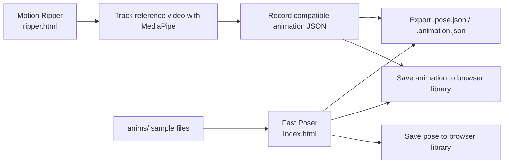

# Animator

Animator is a browser-based 3D posing and lightweight animation sandbox made of two connected tools:

- `Index.html`: the main editor, labeled in the UI as **Fast Poser**
- `ripper.html`: a motion-capture helper, labeled in the UI as **Motion Ripper**

The project is designed for fast previs and experimentation rather than full character animation production. You can manually pose simple box-rig characters, build keyframed animations, save reusable poses and timelines, import and export JSON assets, and generate new animation clips from reference video by using browser screen sharing plus MediaPipe pose tracking.

There is no build step, no backend, and no package install. The repo is a static site that runs directly in a modern browser.

## What This Project Does

Animator gives you a quick way to do all of the following without leaving the browser:

- Block out a pose on a simple humanoid rig
- Build short animations by recording keyframes on a timeline
- Reuse saved poses across scenes
- Reuse saved animations across sessions in the same browser
- Import and export pose and animation assets as JSON files
- Stage scenes with more than one character
- Capture rough motion from a reference clip through Motion Ripper
- Move animation clips from Motion Ripper back into the main editor
- Preserve character count, character colors, playback speed, and animation timing inside exported assets
- Play back special animation metadata such as the included `arcane-summon` effect preset when present in an imported file

## How The Repo Is Organized

| Path | Purpose |
| --- | --- |
| `Index.html` | Main Fast Poser app for manual posing, scene staging, timeline editing, and asset library management |
| `ripper.html` | Motion Ripper app for screen-share pose tracking and animation capture |
| `anims/` | Bundled sample animation JSON files you can import into Fast Poser |
| `anims/*.animation.json` | Example clips such as walks, flips, kicks, two-character spear actions, and an effect-driven summon animation |

## How The Two Tools Fit Together



The normal workflow is:

1. Open `Index.html` to pose characters and work on the timeline.
2. Open `ripper.html` when you want to pull motion from a reference video.
3. Save or export a captured clip from Motion Ripper.
4. Load that clip back into Fast Poser to preview, edit, combine, or re-export it.

## Quick Start

### Recommended Way To Run It

Serve the repository through a simple local static web server and open the pages in the same browser.

Why this is recommended:

- both pages rely on browser APIs and CDN-loaded dependencies
- Motion Ripper needs screen-sharing support
- the shared pose and animation libraries use `localStorage`, so using the same origin matters
- `Index.html` has an uppercase `I`, which is safer to open explicitly than relying on a host to guess the entry file

### Open The Project

Use any static server you like, then visit:

- `http://localhost:PORT/Index.html`
- `http://localhost:PORT/ripper.html`

Common ways to serve the folder:

- VS Code Live Server
- `npx serve .`
- `python -m http.server 8000`
- any equivalent static host or local server

### Important Notes

- Open `Index.html` with the exact casing shown here, especially on case-sensitive hosts.
- Use the same browser and the same origin for `Index.html` and `ripper.html` if you want the shared browser library to work.
- Motion Ripper depends on MediaPipe assets loaded from the internet, so an offline browser session will not fully work.

## Fast Poser Features

Fast Poser is the manual editing side of the project. It opens a 3D scene with a simple humanoid box rig, a pose library, an animation library, and a bottom timeline.

### Scene And Character Features

| Feature | What It Does | How To Use It |
| --- | --- | --- |
| Add Character | Creates another simple humanoid rig in the scene | Click `Add Character` |
| Multi-character staging | Supports scenes with several characters at once | Add multiple characters, then pose each one separately |
| Automatic placement | Places new characters in preset positions so they do not overlap immediately | Just keep clicking `Add Character`; placement is automatic |
| Random starting colors | New characters are created with distinct random colors unless a loaded asset specifies colors | Add a character or load an asset with saved colors |
| Clear Scene | Removes all characters and also clears the current animation timeline | Click `Clear Scene` |
| Selectable joints | Every limb segment can be selected with the mouse | Left-click a body part in the viewport |
| Transform gizmo | Lets you rotate or translate the selected joint | Select a body part, then use the gizmo |
| Camera orbit controls | Lets you inspect the pose from different angles | Right-click drag to pan and use the mouse wheel to zoom |

### Pose Editing Features

| Feature | What It Does | How To Use It |
| --- | --- | --- |
| Rotate mode | Rotates the selected joint in local space | Click `Rotate (R)` or press `R` |
| Move mode | Pulls the rig from the selected body part so the torso and hips lean/follow instead of the limb detaching | Click `Move (T)` or press `T` |
| Selection readout | Shows the currently selected body part name | Look at the top-right selection panel |
| Deselect | Clears the current joint selection | Click empty space or press `Esc` |
| Live keyframe editing | If a keyframe is selected, moving the rig updates that keyframe immediately | Select a keyframe, pose the character, and the frame is updated |

### Timeline And Animation Features

| Feature | What It Does | How To Use It |
| --- | --- | --- |
| Record Keyframe | Stores the current pose at the current timeline time | Move the rig, set the time, then click `Record Keyframe` |
| Timeline scrubbing | Moves the playhead and previews the pose at that time | Click or drag on the timeline |
| Keyframe selection | Lets you focus a specific frame for editing or deletion | Click a keyframe marker |
| Keyframe retiming | Drag keyframe markers left or right to change timing | Drag the diamond markers on the timeline |
| Playback | Plays the animation from the current time | Click `Play` or press `Space` |
| Stop | Stops playback without clearing the animation | Click `Stop` or press `Space` again |
| Speed control | Changes playback speed from `0.25x` to `2.5x` | Adjust the `Speed` slider |
| Time input | Lets you type an exact current time | Edit the `Time` field |
| Delete selected frame | Removes the currently selected keyframe | Click `Delete Selected` or press `Delete` / `Backspace` |
| Clear Anim | Clears all keyframes and resets the timeline | Click `Clear Anim` |
| Auto-expanding timeline | Grows the visible duration to fit the animation or current scrub time | Happens automatically while editing |
| Interpolated playback | Blends positions linearly and rotations with quaternion slerp between keyframes | Create at least two keyframes and press play |

### Pose Library Features

| Feature | What It Does | How To Use It |
| --- | --- | --- |
| Save Pose | Saves the current scene pose into the browser pose library | Enter a name and click `Save Pose` |
| Apply Pose | Applies a saved pose to the current scene | Select a saved pose and click `Apply Pose` |
| Export Pose | Downloads a saved pose as JSON | Select a pose and click `Export Pose` |
| Import Pose | Reads a pose JSON file and adds it to the library | Click `Import Pose` and choose a file |
| Delete Pose | Removes the selected pose from the browser library | Select it and click `Delete Pose` |
| Auto-apply on import | Imported poses are immediately loaded into the current scene | Import a pose JSON file |
| Name replacement behavior | Saving a pose with an existing name replaces the earlier one | Reuse the same pose name and save again |

### Animation Library Features

| Feature | What It Does | How To Use It |
| --- | --- | --- |
| Save Anim | Saves the current timeline as an animation asset | Enter a name and click `Save Anim` |
| Load Anim | Loads a saved animation into the scene | Select an animation and click `Load Anim` |
| Export Anim | Downloads the selected animation as JSON | Select an animation and click `Export Anim` |
| Import Anim | Reads an animation JSON file and adds it to the library | Click `Import Anim` and choose a file |
| Delete Animation | Removes the selected animation from the browser library | Select it and click `Delete Animation` |
| Auto-load on import | Imported animations are immediately loaded into the scene | Import an animation JSON file |
| Scene sync on load | Character count and colors are recreated from the asset if needed | Load a clip created for one or more characters |
| Shared format with Motion Ripper | Motion Ripper exports animation JSON that Fast Poser can load directly | Export or save from `ripper.html`, then load it here |

### Keyboard And Mouse Shortcuts

| Input | Result |
| --- | --- |
| `R` | Switch to rotate mode |
| `T` | Switch to move mode |
| `Space` | Play or stop the animation |
| `Delete` / `Backspace` | Delete the selected keyframe when not typing in a field |
| `Esc` | Deselect the current joint |
| Left click on rig | Select a joint |
| Left drag on gizmo | Manipulate the selected joint |
| Right click drag | Pan the camera |
| Mouse wheel | Zoom camera |

## Motion Ripper Features

Motion Ripper is the capture side of the repo. Instead of hand-posing a rig, you share a screen or window that contains a reference video, let MediaPipe estimate the performer pose, and record the tracked result as a Fast Poser animation asset.

### Capture And Tracking Features

| Feature | What It Does | How To Use It |
| --- | --- | --- |
| Share Screen / Window | Starts browser screen capture for a reference clip | Click `Share Screen / Window` and choose the source |
| Stop Share | Stops the current screen share without deleting an already recorded take | Click `Stop Share` |
| MediaPipe warmup | Preloads the pose tracker on page load | Open `ripper.html` and wait for the ready status |
| GPU with CPU fallback | Tries GPU first and falls back to CPU if needed | Happens automatically |
| Pose overlay | Draws a cyan skeleton over the shared video feed | Share a source and wait for tracking to lock |
| Tracking status | Shows whether tracking is waiting, searching, or locked | Watch the `Tracked` and `Confidence` cards |
| Confidence readout | Shows approximate tracking confidence as a percentage | Watch the `Confidence` card |
| Rig preview | Shows the mapped box character on the right side | Follow the performer and inspect the preview |

### Recording Features

| Feature | What It Does | How To Use It |
| --- | --- | --- |
| Animation naming | Gives the take a human-readable name | Type your own name or use the auto-generated default |
| Auto-generated names | Creates names like `rip-YYYYMMDD-HHMM` when the field is empty | Leave the field blank |
| Character Color | Sets the exported preview character color | Use the color picker before saving or exporting |
| Sample Rate | Records at either `10 fps` or `5 fps` | Choose a rate from the dropdown |
| Pose Smoothing | Blends tracked motion to reduce jitter | Adjust the slider while previewing |
| Root motion tracking | Moves the hips in X, Y, and Z relative to a neutral frame | Leave `Track root motion` enabled |
| Neutral capture | Stores the baseline body position used for root motion | Click `Set Neutral` once tracking is stable |
| Start Record / Stop Record | Begins and ends keyframe capture | Click `Start Record`, play the reference, then click again to stop |
| Clear Capture | Clears recorded frames and resets the preview character | Click `Clear Capture` |
| Save To Library | Saves the resulting animation into the same browser animation library used by Fast Poser | Click `Save To Library`, then open `Index.html` in the same browser |
| Export JSON | Downloads the recorded animation as a `.animation.json` file | Click `Export JSON` |

### Practical Motion Ripper Workflow

1. Open `ripper.html`.
2. Wait until the status says MediaPipe is ready.
3. Click `Share Screen / Window` and choose the window where your reference video is playing.
4. Wait until the cyan skeleton follows the performer reliably.
5. Click `Set Neutral` before recording if you want root motion to feel stable.
6. Set `Sample Rate`, `Pose Smoothing`, `Character Color`, and the take name.
7. Click `Start Record`.
8. Play the reference clip.
9. Click `Stop Record` when the motion is finished.
10. Click `Save To Library` to make the clip appear in Fast Poser, or click `Export JSON` to save a file.

### Tips For Better Captures

- Use a reference video with a single clearly visible person.
- Keep the whole body in frame when possible.
- Capture neutral before recording if root motion looks jumpy.
- Turn root motion off if you only care about limb animation.
- Increase smoothing if the pose looks noisy.
- Use the same origin and same browser as Fast Poser if you want `Save To Library` to show up immediately in the main app.

## Included Sample Animations

The `anims/` folder is effectively a starter pack for trying the project.

| File | Characters | Notes |
| --- | --- | --- |
| `forwardflip.animation.json` | 1 | Single-character flip sample |
| `forwardflip-realistic.animation.json` | 1 | Refined single-character flip sample |
| `spinningkick.animation.json` | 1 | Single-character kick sample |
| `spinningkick-realistic.animation.json` | 1 | Refined kick sample |
| `walking-anim.animation.json` | 1 | Single-character walk sample |
| `walking-realistic.animation.json` | 1 | Refined walk sample |
| `spear.animation.json` | 2 | Two-character spear interaction sample |
| `spear-realistic.animation.json` | 2 | Refined two-character spear interaction |
| `summoning-magic.animation.json` | 1 | Demonstrates the built-in `arcane-summon` animation effect metadata |

### How To Use The Samples

1. Open `Index.html`.
2. In the `Animation Library` section, click `Import Anim`.
3. Choose any file from `anims/`.
4. The animation is added to the browser library and loaded immediately.
5. Press `Play` to preview it.

## Asset Format

Fast Poser and Motion Ripper share a plain JSON asset format.

### Pose Asset Shape

Exported pose files look like this in principle:

```json
{
  "format": "fast-poser-asset",
  "version": 1,
  "type": "pose",
  "name": "Guard Stance",
  "savedAt": "2026-04-18T18:00:00.000Z",
  "scene": {
    "characterCount": 1,
    "characterColors": ["#5eead4"]
  },
  "pose": {
    "Hips_0": {
      "position": [0, 2.6, 0],
      "quaternion": [0, 0, 0, 1]
    }
  }
}
```

### Animation Asset Shape

Exported animation files look like this in principle:

```json
{
  "format": "fast-poser-asset",
  "version": 1,
  "type": "animation",
  "name": "Kick Combo",
  "savedAt": "2026-04-18T18:00:00.000Z",
  "scene": {
    "characterCount": 1,
    "characterColors": ["#5eead4"]
  },
  "playbackSpeed": 1,
  "effects": null,
  "keyframes": [
    {
      "time": 0,
      "pose": {
        "Hips_0": {
          "position": [0, 2.6, 0],
          "quaternion": [0, 0, 0, 1]
        }
      }
    }
  ]
}
```

### Joint Naming

Joint names follow the pattern `<JointName>_<CharacterIndex>`. Examples:

- `Hips_0`
- `Spine_0`
- `Head_0`
- `Left_Upper_Arm_0`
- `Right_Lower_Leg_1`

This is how multi-character scenes are stored in a single asset.

### Effect Metadata

Animation files may optionally include an `effects` object.

The bundled `summoning-magic.animation.json` uses:

```json
{
  "preset": "arcane-summon",
  "targetCharacter": 0,
  "startTime": 0.4,
  "peakTime": 2.8,
  "endTime": 4.2
}
```

At the moment, the runtime can play this effect when it is present in an imported animation, but the current UI does not expose a dedicated authoring panel for creating or editing effects by hand.

## Technical Stack

- HTML with inline JavaScript modules
- [Three.js](https://threejs.org/) for 3D rendering, controls, lighting, and rig transforms
- [Tailwind CSS CDN](https://tailwindcss.com/) for the UI styling
- [MediaPipe Tasks Vision Pose Landmarker](https://ai.google.dev/edge/mediapipe/solutions/vision/pose_landmarker) for Motion Ripper pose tracking
- Browser `localStorage` for pose and animation libraries
- Browser file APIs and blob downloads for import/export

## Limitations And Current Boundaries

This project is intentionally lightweight, and that shows up in a few important ways:

- The rig is a simple blocky humanoid, not a skinned character mesh.
- There is no backend or project file system beyond browser storage and exported JSON files.
- The shared pose and animation libraries are browser-local, not synced across machines.
- Motion Ripper tracks a single performer and records a single character per take.
- Motion Ripper depends on screen sharing, WebGL, MediaPipe, and internet-loaded assets.
- Fast Poser supports playback of imported effect metadata, but there is no full effect editor in the UI yet.
- There is no formal build, test, or packaging pipeline in the repo right now.

## Troubleshooting

### The main app opens but the libraries seem empty every time

Use a normal local server and open both pages from the same origin in the same browser. `localStorage` is where the libraries live.

### Motion Ripper says MediaPipe could not load

Check the internet connection first. The page loads MediaPipe code and the pose model from external URLs.

### Screen sharing fails or is canceled

Make sure the browser allows screen sharing and retry from `http://localhost` or another trusted context.

### I recorded something, but it will not play in Fast Poser

Fast Poser needs at least two keyframes to produce visible playback. A single keyframe can still be loaded, edited, and re-recorded.

### Root motion looks unstable

Track the performer until the skeleton is stable, then click `Set Neutral` before recording. If you only want upper-body and limb motion, disable `Track root motion`.

### The host root URL does not open the app automatically

This repo uses `Index.html` with an uppercase `I`. On some hosts you may need to navigate directly to `/Index.html`, or rename the file as a future cleanup.

## Best Use Cases

Animator is especially useful for:

- blocking out action beats for a game or animation idea
- building rough previs for short moves
- capturing approximate motion from a reference clip
- creating reusable pose libraries for recurring characters
- testing timing before moving into a heavier DCC pipeline
- sharing animation ideas as small JSON files

## Summary

If you want the shortest possible description of the project:

Animator is a no-build browser toolset for posing simple 3D humanoids, creating timeline-based animations, and extracting rough animation clips from reference video, all using a shared JSON asset format that moves cleanly between the main editor and the Motion Ripper companion page.
